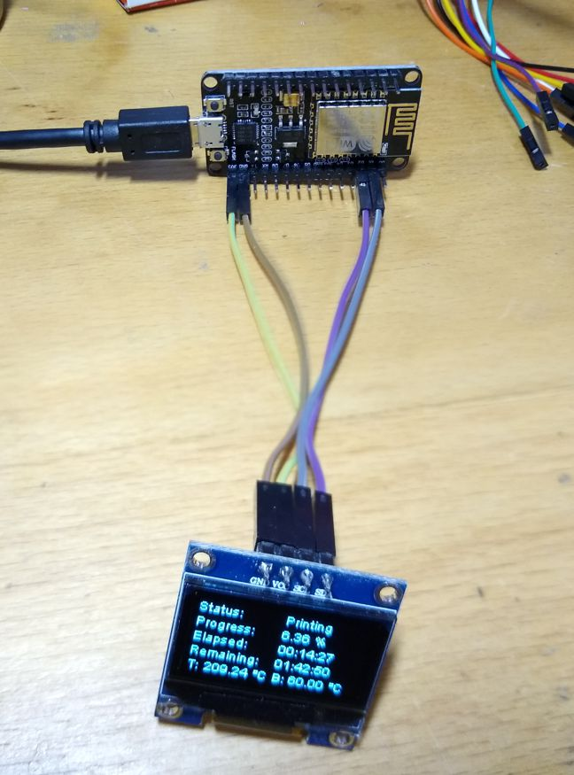
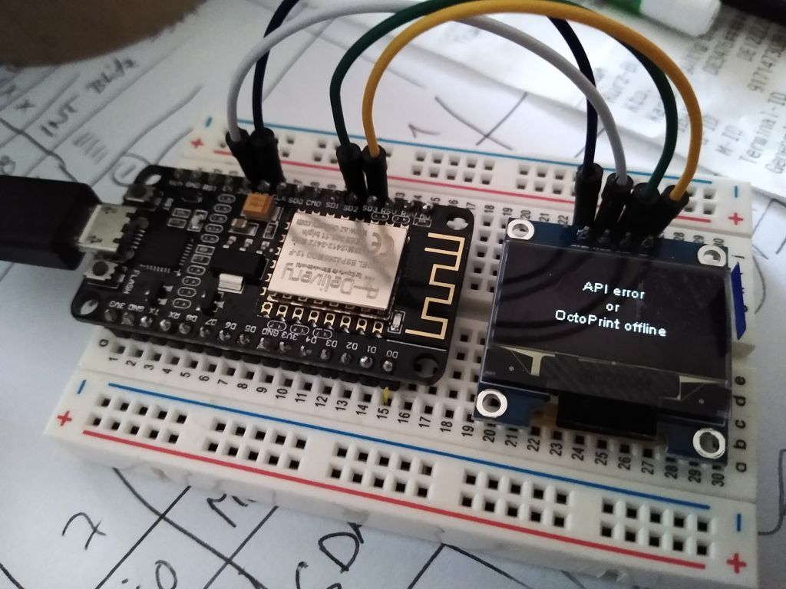

# ESP8266-OctoPrint-Monitor

A basic OctoPrint-Monitor with ESP8266 (I use an NodeMCU v2) and SSD1306 OLED

## Summary

Code for a (very) basic OctoPrint monitor with a SSD1306 OLED display, displays job information when printing. Has basic support for NTP and time handling, but is unused in the code. 

Feel free to adopt to your needs.

## Copyright and sources

* Copyright (c) 2020 noppingen: https://github.com/noppingen/ESP8266-OctoPrint-Monitor/

## Get it running

* Create a new PlatformIO project, paste `main.cpp`
* Add required libraries: 
** `ArduinoJson` version 6: https://github.com/bblanchon/ArduinoJson
** `ThingPulse esp8266-oled-ssd1306`: https://github.com/ThingPulse/esp8266-oled-ssd1306
** `NTPclient`: https://github.com/arduino-libraries/NTPClient
** `Time`: https://playground.arduino.cc/Code/Time/
* Set
** `YOUR_OCTOPRINT_HOST`
** `YOUR_OCTOPRINT_API_KEY`
** `YOUR_WIFI_SSID`
** `YOUR_WIFI_PASS`
** `YOUR_NTP_HOST`
** `SCL`
** `SDA` pin
* Wire 4 pins
* Print a case

## Images

